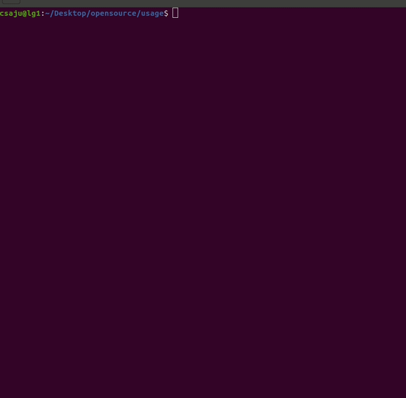

======
asciju
======

.. image:: https://img.shields.io/pypi/v/asciju.svg
        :target: https://pypi.python.org/pypi/asciju

.. image:: https://img.shields.io/travis/aju100/asciju.svg
        :target: https://travis-ci.com/aju100/asciju

.. image:: https://readthedocs.org/projects/asciju/badge/?version=latest
        :target: https://asciju.readthedocs.io/en/latest/?version=latest
        :alt: Documentation Status

Python package that converts image to ascii

* Free software: MIT license
* Documentation: https://asciju.readthedocs.io.

Features
--------

* Conversion image to ASCII art

Roadmap
--------

* Text ASCII art
* Video conversion on ASCII Art
* Fix CLI argument parser
* Improved Documentation
* Unit Test

Usage
-----

Convert your image into ASCII art::

        from asciju import convert_img_ascii

        print(convert_img_ascii('yourimage.jpeg','output.txt'))

Run the python script::

        python3 nameofthescript.py

Contribute
------------
.. _contribute: https://github.com/Aju100/asciju/blob/main/CONTRIBUTING.rst

Contributions are always welcome! Please read the `contribution guidelines <contribute_>`_ first.

Made with heart and Python